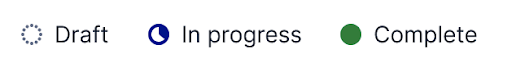
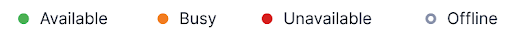
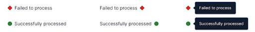

import {graphql} from 'gatsby';
import {Alert} from '@twilio-paste/alert';
import {Anchor} from '@twilio-paste/anchor';
import {Box} from '@twilio-paste/box';
import {Callout, CalloutTitle, CalloutText} from '../../../components/callout';
import {DoDont, Do, Dont} from '../../../components/DoDont';
import {Card} from '@twilio-paste/card';
import {Disclosure, DisclosureHeading, DisclosureContent} from '@twilio-paste/disclosure';
import {Flex} from '@twilio-paste/flex';
import {FormInput, FormLabel, FormHelpText} from '@twilio-paste/form';
import {Grid, Column} from '@twilio-paste/grid';
import {Heading} from '@twilio-paste/heading';
import {Paragraph} from '@twilio-paste/paragraph';
import {Stack} from '@twilio-paste/stack';
import {Text} from '@twilio-paste/text';
import {ProcessDisabledIcon} from '@twilio-paste/icons/esm/ProcessDisabledIcon';

import {processStatus} from '../../../component-examples/StatusPatternExamples';

export const pageQuery = graphql`
  {
    mdx(fields: {slug: {eq: "/patterns/status-pattern/"}}) {
      fileAbsolutePath
      frontmatter {
        slug
        title
      }
      headings {
        depth
        value
      }
    }
    allAirtable(filter: {data: {Feature: {eq: "Status pattern"}}}) {
      edges {
        node {
          data {
            Documentation
            Figma
            Design_committee_review
            Engineer_committee_review
            Code
            status
            Product_suitability
          }
        }
      }
    }
  }
`;

<content>

<PatternHeader
  description={props.pageContext.frontmatter.description}
  name={props.pageContext.frontmatter.title}
  packageStatus={props.data.allAirtable.edges}
/>

</content>

---

<contentwrapper>

<PageAside data={props.data.mdx} />

<content>

## Ingredients

<Grid gutter="space30" marginBottom="space80">
  <Column>
    <Card>
      <Heading as="h3" variant="heading40" marginBottom="space0">
        <Anchor href="/icons">Icon</Anchor>
      </Heading>
    </Card>
  </Column>
  <Column>
    <Card>
      <Heading as="h3" variant="heading40" marginBottom="space0">
        <Anchor href="/primitives/text">Text</Anchor>
      </Heading>
    </Card>
  </Column>
  <Column>
    <Card>
      <Heading as="h3" variant="heading40" marginBottom="space0">
        <Anchor href="/primitives/box">Box</Anchor>
      </Heading>
    </Card>
  </Column>
</Grid>

```jsx
// import all components for Status patterns

import {​ Text } from "@twilio-paste/core/text";
import { Box } from '@twilio-paste/core/box';
```

## Usage

## General usage

Statuses are used to communicate the dynamic state of an object to a user.
Use them to help the user identify something that requires their attention and often, their action.
When a status is used to indicate to the user that they need to take action, be sure to provide
clear controls to take that action (e.g. a “Try again” button).

Statuses are:

- Always related to an object. For example, a SIM can have a status, but a step in a wizard flow cannot.
- Not used for static attributes. For example, “SMS-capable” is not a status on a phone number.
- Different from <Anchor href="/patterns/notifications">notification/feedback messaging</Anchor>, which is in direct response to a user action.
- Different from <Anchor href="/components/alert">alert messaging</Anchor>, which is from the system.
- Used to draw a user’s attention to important information. Use <Anchor href="#">plain text statuses</Anchor> when the status is not critical information for a user to know.

### Accessibility

Non-text status indicators (such as icons or status dots) should be paired with text whenever
possible and should always be given a `title` to give context and meaning to the icon or shape.
Check out the <Anchor href="/icons/usage-guidelinse">icon usage guidelines</Anchor> for more detailed accessibility information.

## Variations

### Process status

Process statuses indicate an object’s progress through a certain set of stages. There are generally 2 or more stages in a given process,
which may be considered “good”, “bad”, or “neutral”. Process statuses are composed of a status Icon and Text.

<b>Process icons should be paired with text whenever possible.</b> When using process icons, try to limit the number of icons
used to 3 or 4 of the most important statuses. For statuses that are not as critical to a user’s workflow, consider <Anchor href="#">
  plain text statuses
</Anchor>
.

<LivePreview scope={{Box, Text, ProcessDisabledIcon}} noInline language="jsx">

</LivePreview>



### Connectivity Status

Connectivity statuses are used to show if a user, object, or system is online or offline. Connectivity statuses are composed of a circle (using Box) and Text.

**Connectivity statuses should almost always be paired with accompanying text**, though Available and Offline can be used without text in cases where space is constrained, since there is a shape difference.


### Plain text status

Not all statuses need icons or shapes. In fact, giving every status an icon or a shape can make it difficult for a user to find and focus on the most critical information.
If some statuses—such as successes or failures—are highly critical, consider using plain text for the other statuses that a user may not need to identify as quickly.

## Composition

### Icon and text placement

The status icon or dot should most often be placed as a prefix, before the status text, though some page layouts may benefit from placing the icon as a suffix.
A suffix icon is often beneficial when a status is right-aligned within a Card or List.

For process statuses, the icon should generally be the same size as the line-height of the status text (e.g. use `$size-icon-20` for a status icon paired with text at `$line-height-20`).

**It is strongly recommended that status icons be paired with text**, especially for statuses that are important for a user to understand.

In cases when screen space is constrained and only a status shape will fit, the status should be put into a tooltip that contains the status text.


### Positioning in a table

Statuses are most often used in tables across our products.
Placement of the status in the table should depend on the importance of the status to the given user flow and should be tested with users.

Table LivePreview

### Pairing process statuses with plain text statuses

Using plain text statuses for non-critical information and process statuses for critical information
is a great way to highlight information that is most important for a user to know.

Table LivePreview

### Providing additional information on a status

It can often be beneficial to provide additional information on a status. The best way to do this is to provide description text directly below the status.
This makes the information easily discoverable and is the simplest way for screen reader users to access it.

In cases where the additional information won’t fit in the space below the status,
it can be placed in a <Anchor href="/components/tooltip">Tooltip</Anchor> when a user hovers on the status, or in a <Anchor href="/components/popover">Popover</Anchor> if there is any interactive content.

LivePreview w/ tooltip and popover

### Adding a link to a status

Linking out to additional information is a great way to add more context to a status and guide the user towards their next steps.

<Anchor href="/components/anchor">Anchors</Anchor> can be placed directly on status text or within help text below the status.
<Anchor href="components/button/#examples">Link-style Buttons</Anchor> can be used when clicking the text performs an in-page
action, such as opening a modal.

### Other common placements

Statuses are not always placed in tables. Other common placements are near avatars (particularly for connectivity statuses), in cards, and in lists.

## Dos and Don'ts

<DoDont>
  <Do
    title="Do"
    body="Use status icons to draw attention to the most important statuses. Try to limit a given set of statuses to 3–4
    icons, and use plain text statuses for the rest. This helps users skim a dense set of data for the information that
    is most critical."
    preview={false}
  />
  <Dont
    title="Don't"
    body="Put a status icon or shape on every status if some statuses are more important than others. If all statuses are of
    equal importance, they can all have icons."
    preview={false}
  />
</DoDont>
<DoDont>
  <Do
    title="Do"
    body="Choose a Process or Connectivity variant for a given status. The Plain Text variant can be mixed in with any other status variant."
    preview={false}
  />
  <Dont
    title="Don't"
    body="Mix Process and Connectivity variants together for a given status. One object can have both a Process and a Connectivity status, but they need to be separated."
    preview={false}
  />
</DoDont>

## Starter kits

- [Figma](https://www.figma.com/file/S4z0Kqjb9AYosnkRQldLte/Paste-Patterns?node-id=531%3A8)

</content>

</contentwrapper>
